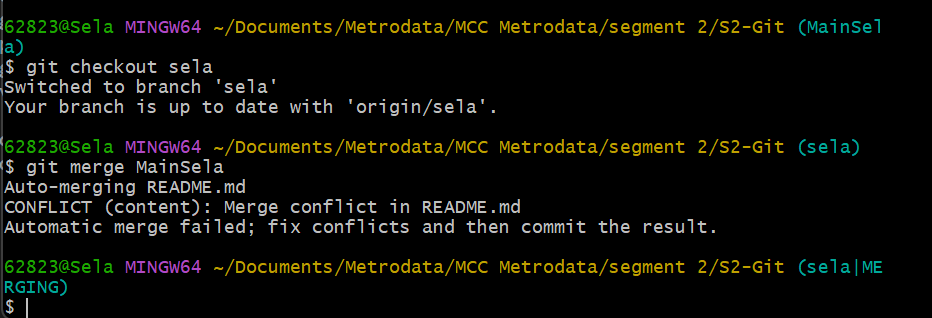
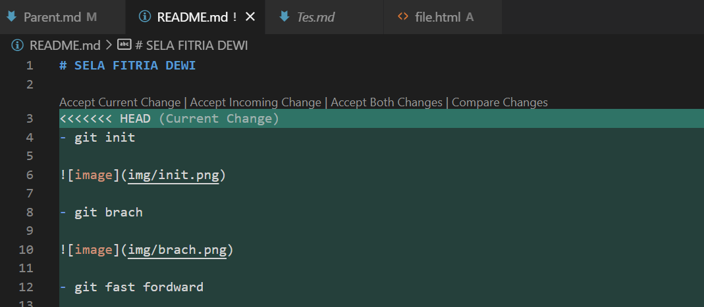
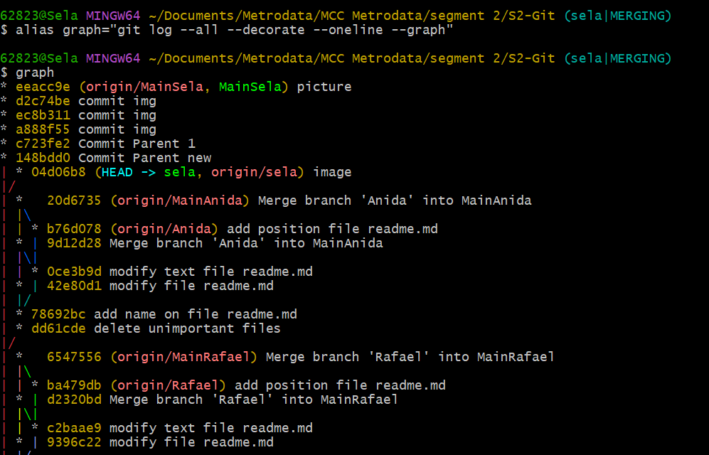
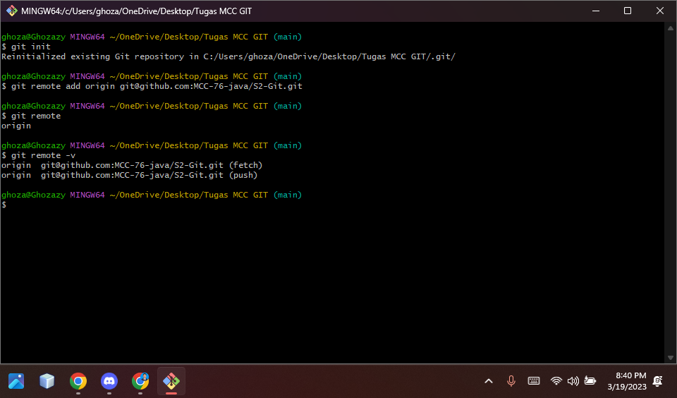
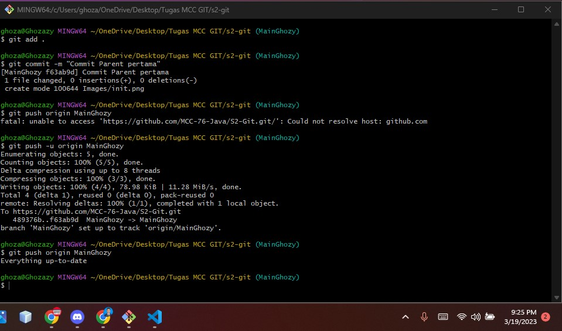
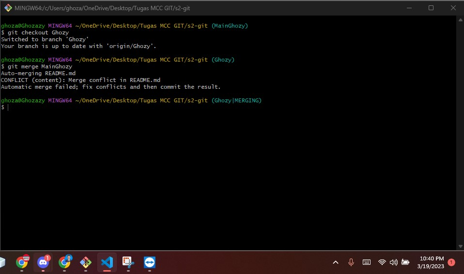
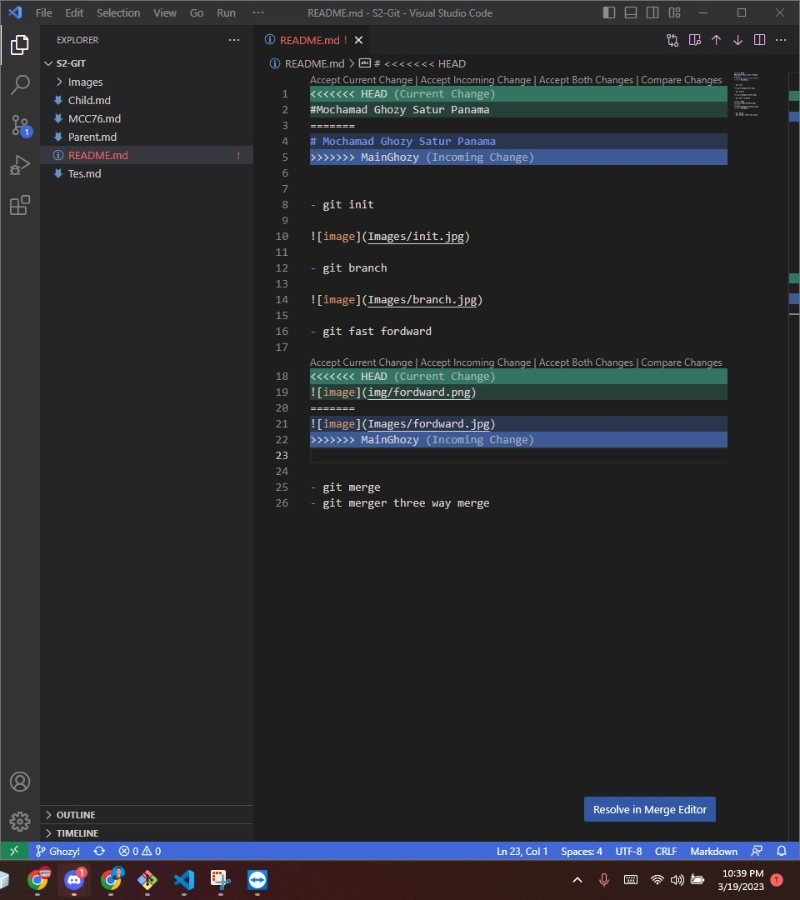
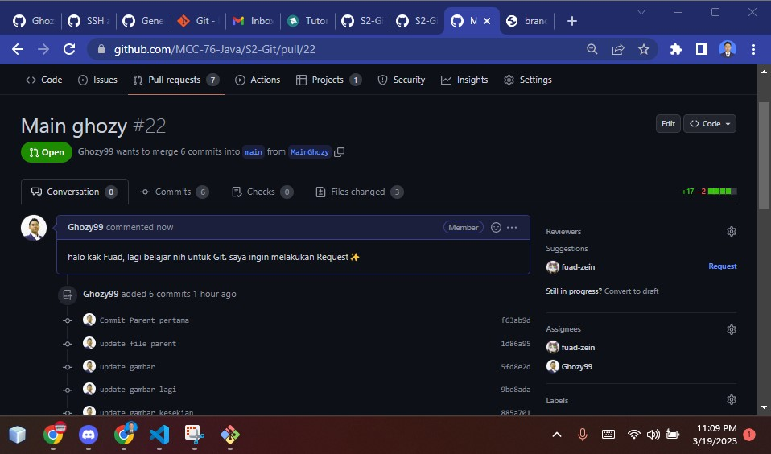

# SELA FITRIA DEWI

- git init

- git brach

- git fast fordward

- git merge conflict

- git merge three way merge

=======
# Mochamad Ghozy Satur Panama

- git init

- git branch

- git fast fordward

- git merge conflict

- git merger three way merge

- git request 

