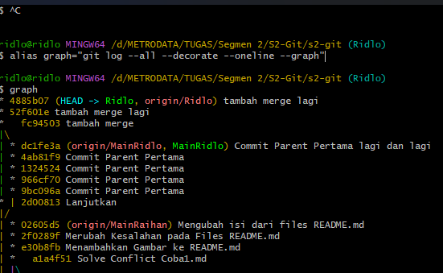

## Semangat...

# RIDLO ALFATORIQ 

- git init

- git branch

- git fast fordward

- git merge

- git merger three way merge

- git request

=======

- git init

- git branch

- git fast fordward

- git merge conflict

- git merger three way merge

- git request 

