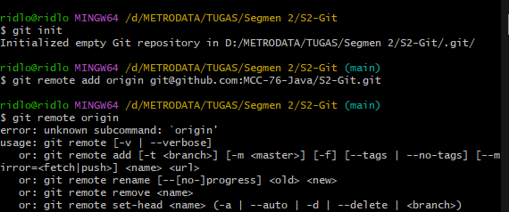

# Hello MCC 76

## Semangat...
<<<<<<< HEAD

# RIDLO ALFATORIQ 
=======
# RIdlo Alfatoriq
>>>>>>> MainRidlo

- git init

- git branch

<<<<<<< HEAD

- git fast fordward

=======

- git fast fordward

>>>>>>> MainRidlo

- git merge

- git merger three way merge