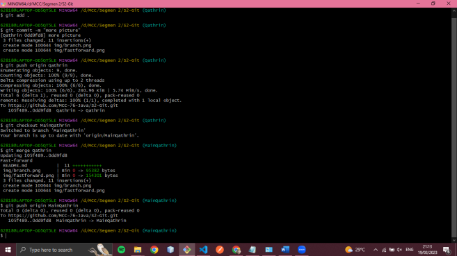
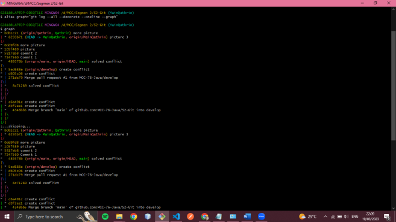

# Hello MCC 

- Git Init

- Git Branch

- Fast Forward

-merge conflict

- Three Ways Merge

- pull request

=======
# Mochamad Ghozy Satur Panama

- git init

- git branch

- git fast fordward

- git merge conflict

- git merger three way merge

- git request 

